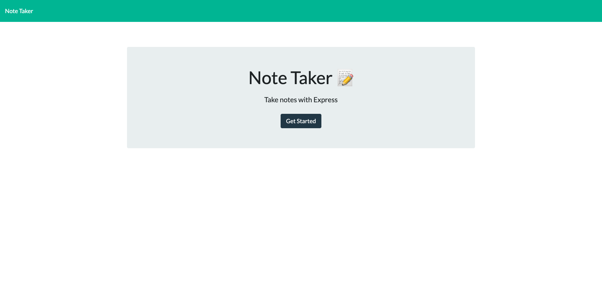
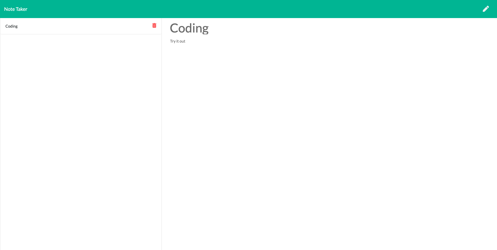

# Note-Taker

Author:
- Lam, Gerald

## Description

This is a notes application which is used to write, save, and delete notes. The app will use an express backend and save and retrieve note data from a JSON file.

Please see below for the application's screenshot:

## Usage

Go to the following link: 

https://github.com/4gerger/note-taker.git

- Click on "Get Started" to get to the notes page
- Type in the fields "Note Title" and "Note Text"
- Click on the "Save" icon on the top righthand corner
- To delete the note, click on the "Delete/Bin" icon next to the "Note Title"

Try it out!

## Libraries and Frameworks

<b>Built with<b>

- NodeJS
- Express.js
- Bootstrap
- CSS

